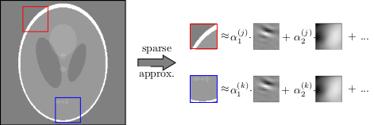
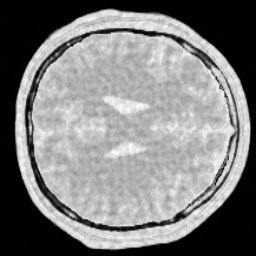
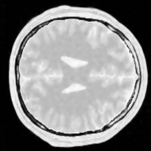
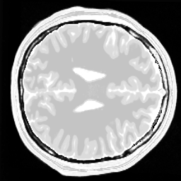

# Customization

We promised that MRIReco allows for customization. Lets in the following
consider a custom data-driven sparsifying transform that is currently not
part of MRIReco.jl [S. Ravishankar and Y. Bresler, IEEE Trans. Med. Imaging, 30 (5), 2011].

It is based on
* Learn a dictionary from a reference image (e.g. adjacent slice) using KSVD  $\color{green}\checkmark$
* Implement sparsifying transform which analyses the input image in terms of the dictionary



In order to implement this, we first need the analyze function where we can reuse
the `matchingpursuit` function from Wavelets.jl
```julia
function analyzeImage(x::Vector{T},D::Matrix{T},xsize::NTuple{2,Int64},
                      psize::NTuple{2,Int64};t0::Int64=size(D,2),tol=1e-3) where T
  nx,ny = xsize
  px,py = psize
  x = reshape(x,nx,ny)
  x_pad = repeat(x,2,2)[1:nx+px-1,1:ny+py-1] # pad image using periodic boundary conditions
  α = zeros(T,size(D,2),nx,ny)
  patch = zeros(T,px*py)
  for j=1:ny
    for i=1:nx
      patch[:] .= vec(x_pad[i:i+px-1,j:j+py-1])
      norm(patch)==0 && continue
      # matchingpursuit is contained in Wavelets.jl
      α[:,i,j] .= matchingpursuit(patch, x->D*x, x->transpose(D)*x, tol)
    end
  end
  return vec(α)
end
```
Synthetization can be done by
```julia
function synthesizeImage(α::Vector{T},D::Matrix{T},xsize::NTuple{2,Int64},psize::NTuple{2,Int64}) where T
  nx,ny = xsize
  px,py = psize
  x = zeros(T,nx+px-1,ny+py-1)
  α = reshape(α,:,nx,ny)
  for j=1:ny
    for i=1:nx
      x[i:i+px-1,j:j+py-1] .+= reshape(D*α[:,i,j],px,py)
    end
  end
  return vec(x[1:nx,1:ny])/(px*py)
end
```
Once we have those two operations we can setup up a dictionary operator:
```julia
function dictOp(D::Matrix{T},xsize::NTuple{2,Int64},psize::NTuple{2,Int64},tol::Float64=1.e-3) where T
  produ = x->analyzeImage(x,D,xsize,psize,tol=tol)
  ctprodu = x->synthesizeImage(x,D,xsize,psize)
  return LinearOperator(prod(xsize)*size(D,2),prod(xsize),false,false
          , produ
          , nothing
          , ctprodu )
end
```

To test our method, let us load some simulated data and subsample it
```julia
# phantom
img = readdlm("data/mribrain100.tsv")

acqData = AcquisitionData(ISMRMRDFile("data/acqDataBrainSim100.h5"))
nx,ny = acqData.encodingSize

# undersample kspace data
acqData = sample_kspace(acqData, 2.0, "poisson", calsize=25,profiles=false);
```

Now we load a pre-trained dictionary, build the sparsifying transform and perform the reconstruction
```julia
# load the dictionary
D = ComplexF64.(readdlm("data/brainDict98.tsv"))

# some parameters
px, py = (6,6)  # patch size
K = px*py       # number of atoms

# CS reconstruction using Wavelets
params = Dict{Symbol,Any}()
params[:reco] = "standard"
params[:reconSize] = (nx,ny)
params[:iterations] = 50
params[:λ] = 2.e-2
params[:regularization] = "L1"
params[:sparseTrafo] = dictOp(D,(nx,ny),(px,py),2.e-2)
params[:ρ] = 0.1
params[:solver] = "admm"
params[:absTol] = 1.e-4
params[:relTol] = 1.e-2

img_d = reconstruction(acqData,params)
```
For comparison, let us perform the same reconstruction as above but with a Wavelet transform
```julia
delete!(params, :sparseTrafo)
params[:sparseTrafoName] = "Wavelet"

img_w = reconstruction(acqData,params)
```

The following pictures shows the wavelet
based CS reconstruction on the left and the dictionary based CS reconstruction
on the right:




For reference, the original data is shown here:



One can clearly see that the dictionary approach performs better than a simple
Wavelet L1 prior.
