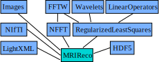
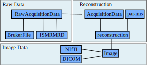

# Overview

As outlined in the introduction [MRIReco.jl](@ref) MRIReco has the philosophy to
to reuse functionality provided by other Julia package and basically add the
MRI specific functionality. This approach is enabled by the Julia package manager
that can handle all dependencies automatically. Packages are therefore considered
to be cheap in Julia so that modularization can be done across packages. In the
following graph, the most important (not all) dependencies of MRIReco are visualized.

Most importantly, all iterative solvers are implemented in RegularizedLeastSquares.jl
so that MRIReco can benefit from all improvements made in that package. Gridding
is implemented in the NFFT.jl package, which has many applications byond MRI.
Sparsifying transformations are usually also not MRI specific and therefore implemented
in independent packages (e.g. Wavelets.jl). For storing image data MRIReco.jl uses
NiFTI.jl. Dicom data can potentially be saved by the DICOM.jl package, which, however,
is not a hard dependency of MRIReco.

## Data Types and Flow

An overview about the most important data types and the data flow during recosntruction
is given in the following figure.

Raw data is usually obtained from files (discussed in [File Handling](@ref)). Since
the data layout of the `RawAcquisitionData` object is not perfectly suited for
reconstruction, we  
