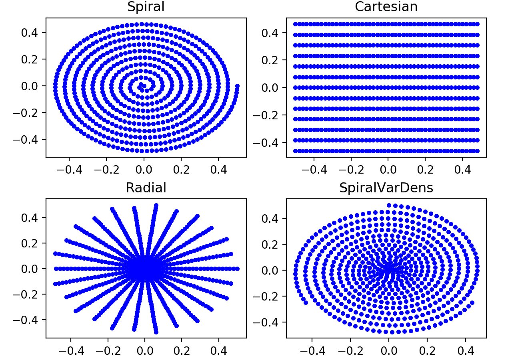

# Trajectory

Several typical MRI k-space trajectories are available:
* Cartesian
* EPI
* Radial
* Spiral
In addition, it is also possible to define new k-space
trajectories. Currently, most of the trajectories are only available in 2D. Each trajectory
is of type `Trajectory` and implements the following functions
```julia
string(tr::Trajectory)
kspaceNodes(tr::Trajectory)
readoutTimes(tr::Trajectory)
```
For instance we can define a spiral, radial, and cartesian trajectory using
```julia
tr = trajectory("Spiral", 1, 600, windings=10)
tr = trajectory("Cartesian", 13, 50, EPI_factor=1)
tr = trajectory("Radial", 13, 50)
```
A variable density spiral can be generated by
```julia
tr = trajectory("SpiralVarDens", 3, 200)
```
The k-space nodes can then be accessed by
```julia
nodes = kspaceNodes(tr)
```

The script generating the following image can be executed by running
the following from within the Julia REPL:
```julia
include(joinpath(dirname(pathof(MRIReco)),"../docs/src/examples/exampleTrajectories.jl"))
```


